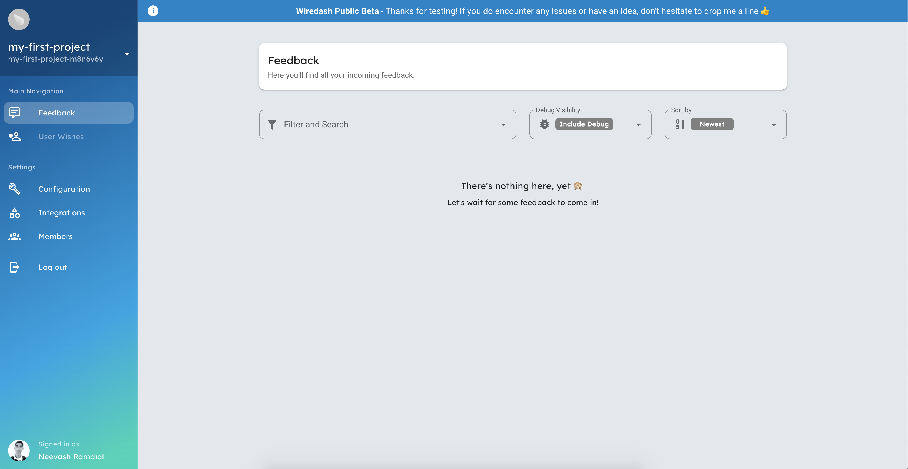
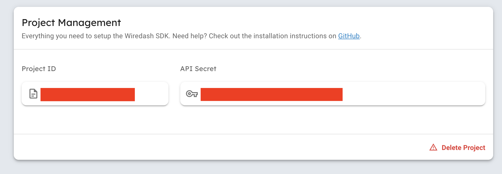

#  Wiredash Getting Started Guide
Thank you for choosing Wiredash 🎉 We are thrilled to have you on board! 

This guide will get you up and running with Wiredash in just a few short steps. 

## Installation 
1. Create a project 📦
2. Add to Flutter 🛠
3. Done 🥳

### 1. Create an account 
Before we can add Wiredash to our Flutter application, we first need to create an account. Navigate to [https://console.wiredash.io/login](https://console.wiredash.io/login) then select “Sign Up”.
Users are able to create an account using Github and Google  login. 

Once you have successfully created an account, you will be directed to the projects page of the Wiredash console. Here, users are able to view the different projects they are apart of.  

Let’s create a new project by clicking the “Create new Project” option. 
For the purposes of this guide, let’s call it `my-first-project`.


With the project created, you are taken to the `Feedback` tab of the project console.


Before closing the  console, head to the `Configuration` tab and copy the values for “Project ID” and “API Secret”. We will need these shortly. 


### 2. Add to Flutter
Nice Job 🎈 You’ve successfully registered and created your first project. Now comes the fun part, adding `Wiredash` to your app. 

First, add the Wiredash package to your Flutter app’s `pubspec.yaml`. 
```yaml
dependencies:
  wiredash: 0.1.0
```

Next, import and  wrap your root widget using the `Wiredash` widget.
```dart
// Add to the top of file
import 'package:wiredash/wiredash.dart';
```

```yaml
return Wiredash(
  child: MaterialApp(
      title: 'Adventure 🌎',
      home: DemoHomePage(),
   ),
);
```

Good job, we are almost finished. You may notice a warning stating a few required parameters are missing. This is because we need to give Wiredash the project id and api secret we copied earlier. 
Go ahead and pass these parameters to the `Wiredash` widget above child.

Before we can run our app, there is one last thing we need to do. In order to show the Wiredash UI, a navigator key is required. We must also pass this key to our `MaterialApp` / `CupertinoApp`/ `WidgetsApp`.

We can create a navigator key using a GlobalState of type `NavigatorState`

```dart
final _navigatorKey = GlobalKey<NavigatorState>();
```

Finally, update the code and pass the key to both `Wiredash` and `MaterialApp`.

```dart
return Wiredash(
  projectId: "YOUR-PROJECT-ID",
  secret: "YOUR-SECRET",
  navigatorKey: _navigatorKey,
  child: MaterialApp(
    navigatorKey: _navigatorKey,
    title: 'Adventure 🌎',
    home: DemoHomePage(),
  ),
);
```

### 3 Done 🎉


Congratulations! You’ve successfully added Wiredash to your project. If you would like to see a completed app, checkout our example app in the project’s Github. 
[https://github.com/wiredashio/wiredash-sdk/blob/nash/updated-sample/example/lib/main.dart](https://github.com/wiredashio/wiredash-sdk/blob/nash/updated-sample/example/lib/main.dart)

There are tons of options and customisations you can make to optimise Wiredash for your app. For more information on customising WireDash, please see [here](/configuration/)